# 业务参考项目搭建教程

本教程主要描述如何在本地运行业务参考系统，便于分析业务流程。

由于参考业务项目开放的代码没有开放所有功能或者多多少少存在一些bug，所以所有操作还是建议参考在线示例。

跑本地项目的目标在于可以观察数据库中数据的变化或者在线参考有时候网络原因无法访问的时候使用，建议大家在访问在线参考的时候截图记录操作过程，防止在线示例无法访问时影响开发进度。

参考链接：[本地部署](http://www.07fly.xyz/doc/v2doc/5.html)

## 1 关于源码

可以通过下面方式克隆代码

```sh
git clone https://git.oschina.net/07fly/FLY-CRM
```

如果你需要修改源码可以克隆到本地然后进行修改，当然如果不需要再本地修改，可以暂时略过此步骤。

通过测试，他的源码在测试环境搭建是有问题的，大概率跑不起来，如果跑不起来需要使用我修改后的源码才行。

## 2 搭建运行环境

参考业务项目是基于`PHP`开发的所以需要搭建`PHP`环境，下面业务参考项目的官方环境要求：

- `PHP5.4`：需要激活`pdo、pdo_mysql、json、pcre`模块；
- `MySQL`： 推荐`MySQL5.5/5.6`、`MariaDB`；
- `WebServer`： 推荐使用`Apache`、`Nginx`、`IIS`。

按照环境要求下面开始搭建`DNMP（Docker + Nginx + MySQL + PHP）`环境。

### 2.1 准备目录和配置文件

```sh
# 创建Nginx、PHP、MySQL、www目录
mkdir /home/dnmp/{mysql,php,nginx,www} -p
# 创建MySQL配置目录、数据存储目录、日志目录
mkdir /home/dnmp/mysql/{conf,data,logs}
# 创建Nginx配置目录、日志存放目录
mkdir /home/dnmp/nginx/{conf,logs}
# 创建PHP配置文件存放目录
mkdir /home/dnmp/php/conf
# 赋予MySQL日志目录权限
chmod 777 /home/dnmp/mysql/logs/
```

将当前目录下面的`dnmp`目录上传到Linux系统的`home`目录下面，里面有我写好的配置，具体配置内容这里不做过多解释，学过docker的都能看懂。

### 2.2 启动容器

在shell终端执行下面命令行

```sh
# 进入配置所在目录
cd /home/dnmp
# 前台方式启动容器
docker-compose up
```

启动成功后，可以看到如下所示的效果

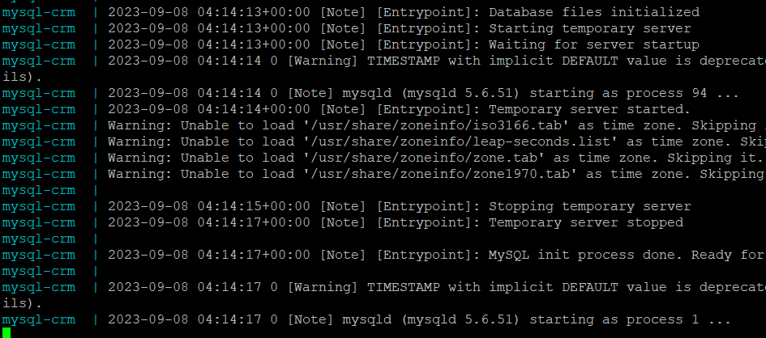

然后通过浏览器访问服务器，查看`PHP`信息，访问地址：http://ip , `IP`地址替换成你的服务器的`IP`地址，成功的话可以看到如下图所示的效果。

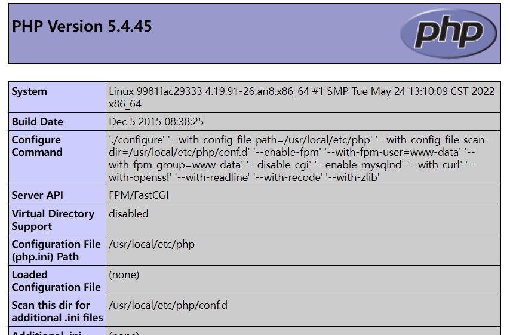

然后`ctrl + c` 停止容器，使用 `dcoker-compose up -d` 以后台方式启动容器，示意如下图所示

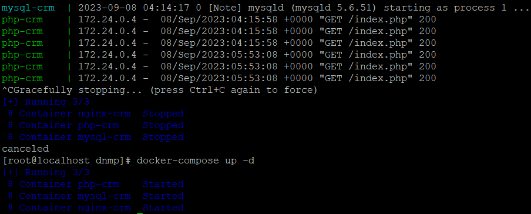

### 2.3 添加`PHP`扩展

有了前面的基础环境虽然能够解析常规的`PHP`脚本，但是没有办法连接数据库，接下来需要给他`PHP`添加扩展。

首先进入`PHP`容器然后查看已经加载的扩展

```sh
# 进入容器
docker exec -it php-crm bash
# 查看加载扩展
php -m
```

执行结果如下

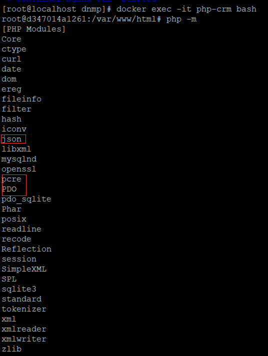

观察发现参考业务项目需要的扩展库基本都有了（***真的是这样的吗？***），就差`pdo_mysql`了，接下来安装一下它，执行下面命令：

```sh
docker-php-ext-install mysql pdo_mysql
```

***提示下面是几个扩展安装的命令，供大家参考。***

- `docker-php-ext-source`：在容器中创建一个`/usr/src/php`目录
- `docker-php-ext-enable`：启用`PHP`扩展，省去我们手工编辑`php.ini`的过程
- `docker-php-ext-install`：安装并启用`PHP`扩展
- `docker-php-ext-configure`：经常与`docker-php-ext-install`搭配，在需要自定义扩展的配置时使用

安装成功可以看到如下所示的效果

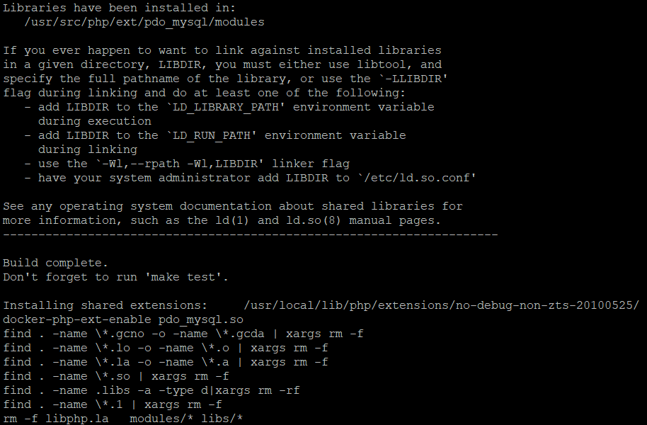

然后退出`PHP`容器，重启容器


测试`MySQL`连接，访问http://ip/conn.php，看到如下图所示的效果，没有问题


## 3 初始化项目

### 3.1 准备源码

由于官方提供的源码执行存在问题，所以建议大家使用我修改后的源码，将我提供的源码上传到`www`目录下面，然后解压。

***提示：我修改的源码是使用`v2`版本，所以你要看官方源码也是看`v2`目录下面的源码。***

上传成功后`www`目录下面的文件情况如下：

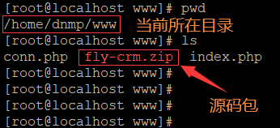

解压源码包，使用`unzip`指令解压，如果没有安装`unzip`，可以使用`yum install unzip` 安装一下，下面是执行解压的命令：

```sh
unzip fly-crm.zip
```

解压完成后，目录结构如下图所示


解压完成后可以将压缩包文件删除了。

### 3.2 启动安装向导

通过浏览器访问系统安装页，访问链接：http://ip/fly-crm/install/index.php , `ip`地址修改你对应服务器的`ip`地址，访问后页面效果如下图所示


此时需要删除一下install目录下面的lock文件

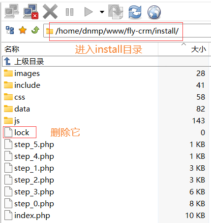

删除完成后刷新页面，可看到如下图所示的效果

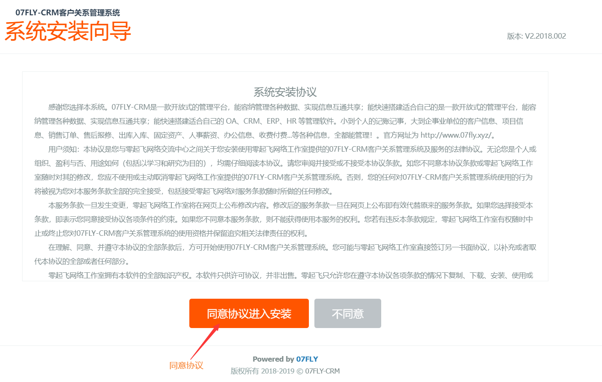

### 3.3 检查模块和目录权限

点击同意后，显示下面所示的效果

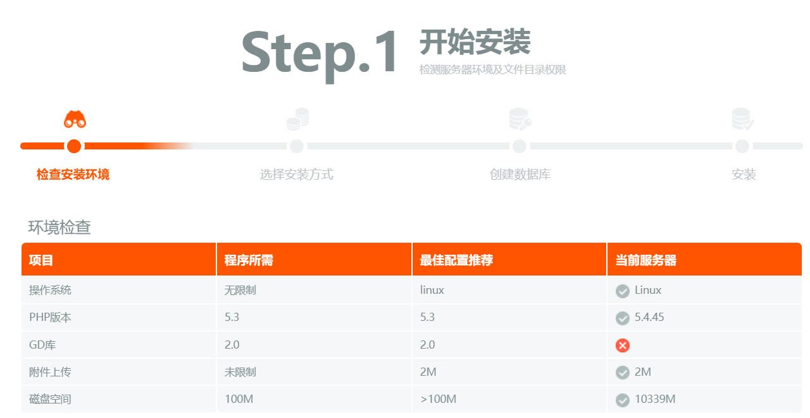

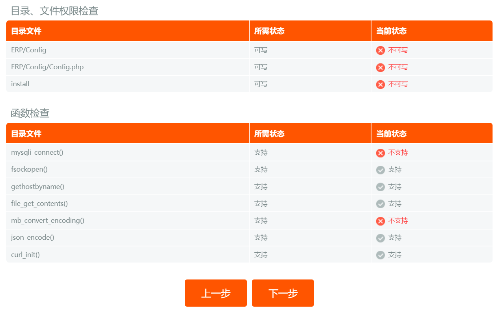

有几个红叉需要我们处理一下。

目录权限文件，需要给他上面列举出来的目录或文件授予写入权限，执行下列命令

```sh
chmod -R 777 /home/dnmp/www/fly-crm/ERP/Config/
chmod -R 777 /home/dnmp/www/fly-crm/ERP/Cache/
chmod -R 777 /home/dnmp/www/fly-crm/install/
```

其他问题就是缺少`php`扩展，进入`php`容器，然后安装扩展，需要一行一行的执行下面命令行

```sh
# 进入php容器
docker exec -it php-crm bash

# 备份原始下载源数据
cp /etc/apt/sources.list /etc/apt/sources.copy.list

# 设置apt下载源为阿里镜像源
echo "deb http://mirrors.aliyun.com/ubuntu/ bionic main restricted universe multiverse" > /etc/apt/sources.list
echo "deb http://mirrors.aliyun.com/ubuntu/ bionic-security main restricted universe multiverse" >> /etc/apt/sources.list
echo "deb http://mirrors.aliyun.com/ubuntu/ bionic-updates main restricted universe multiverse" >> /etc/apt/sources.list
echo "deb http://mirrors.aliyun.com/ubuntu/ bionic-proposed main restricted universe multiverse" >> /etc/apt/sources.list
echo "deb http://mirrors.aliyun.com/ubuntu/ bionic-backports main restricted universe multiverse" >> /etc/apt/sources.list

# 打印设置情况
# cat /etc/apt/sources.list

# 更新下载源
apt-get clean
apt-get update

# 安装gd扩展
apt-get install -y libfreetype6-dev
apt-get install -y libjpeg-dev
apt-get install -y libpng-dev
docker-php-ext-install gd

# 安装mysqli扩展
docker-php-ext-install mysqli

# 安装mbstring扩展
docker-php-ext-install mbstring

# 安装zip扩展
docker-php-ext-install zip
```

如果你在执行 `apt-get update` 出现类似下面的错误


可以使用下面的命令，其中`${keys}`需要替换成你报错的`key`，如上图所示，我这里对应的key是 `3B4FE6ACC0B21F32`

```sh
apt-key adv --keyserver keyserver.ubuntu.com --recv-keys ${keys}
```

执行示例如下

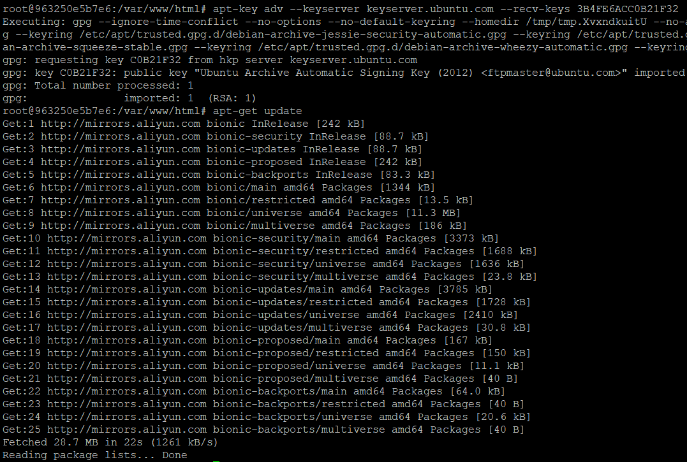

所有操作顺利完成后，重启一下`php`容器。

然后再刷新页面观察是否还有错误信息，看到如下图所示的信息表示环境检查通过。

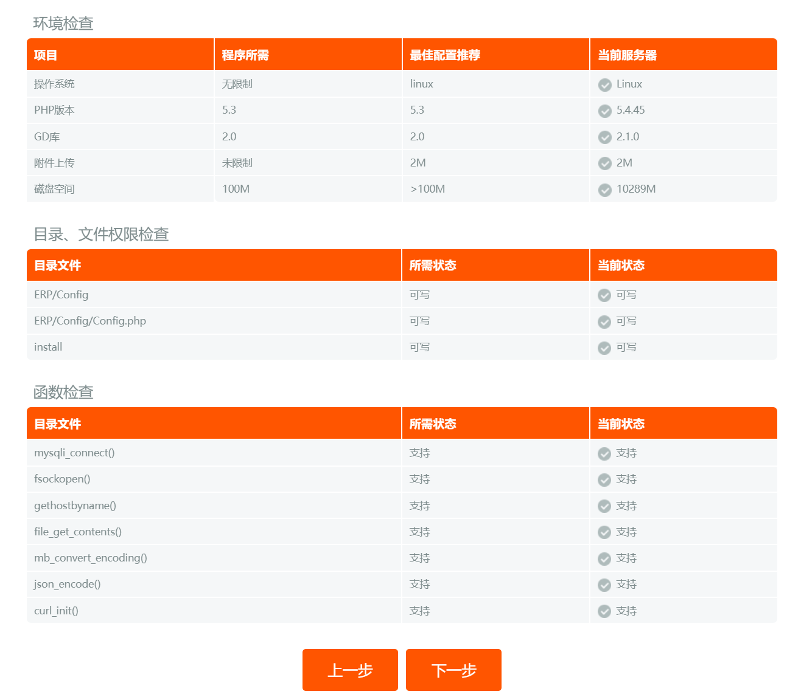

点击下一步

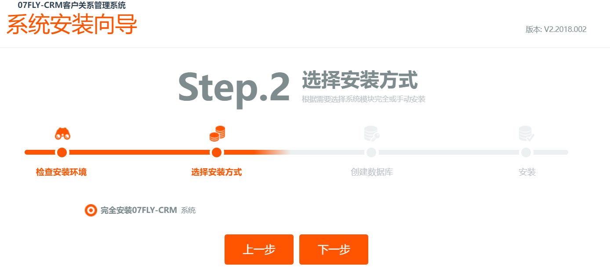

再点击下一步

### 3.4 设置数据库

根据你的情况填写信息，如下图所示

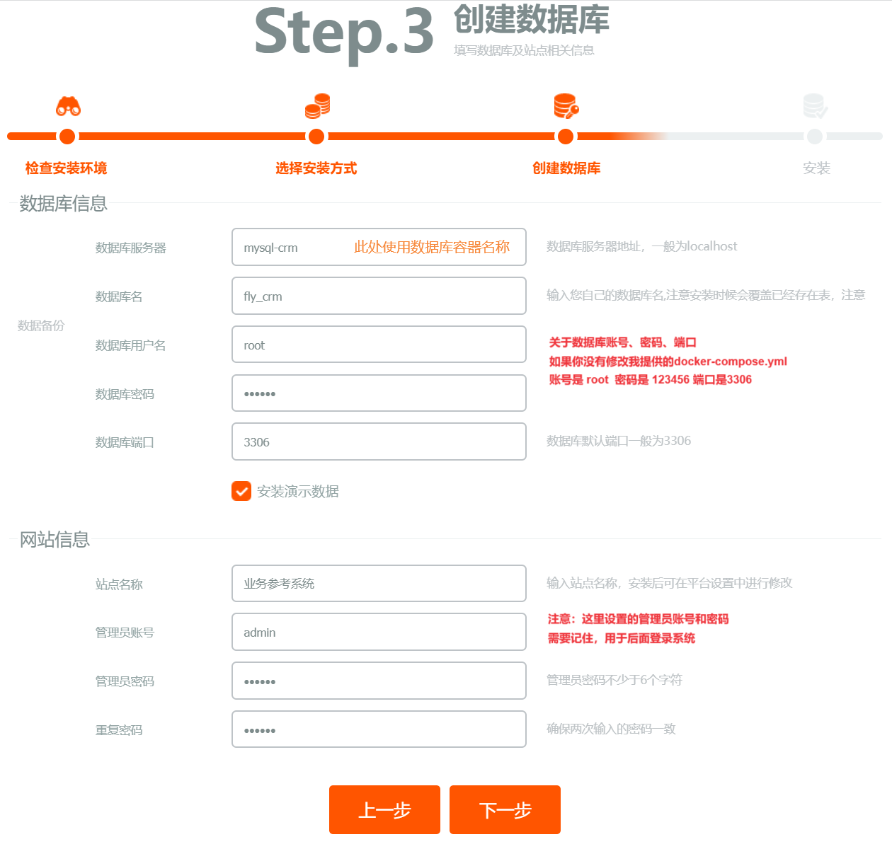

点击下一步。

### 3.5 安装数据库和保存配置

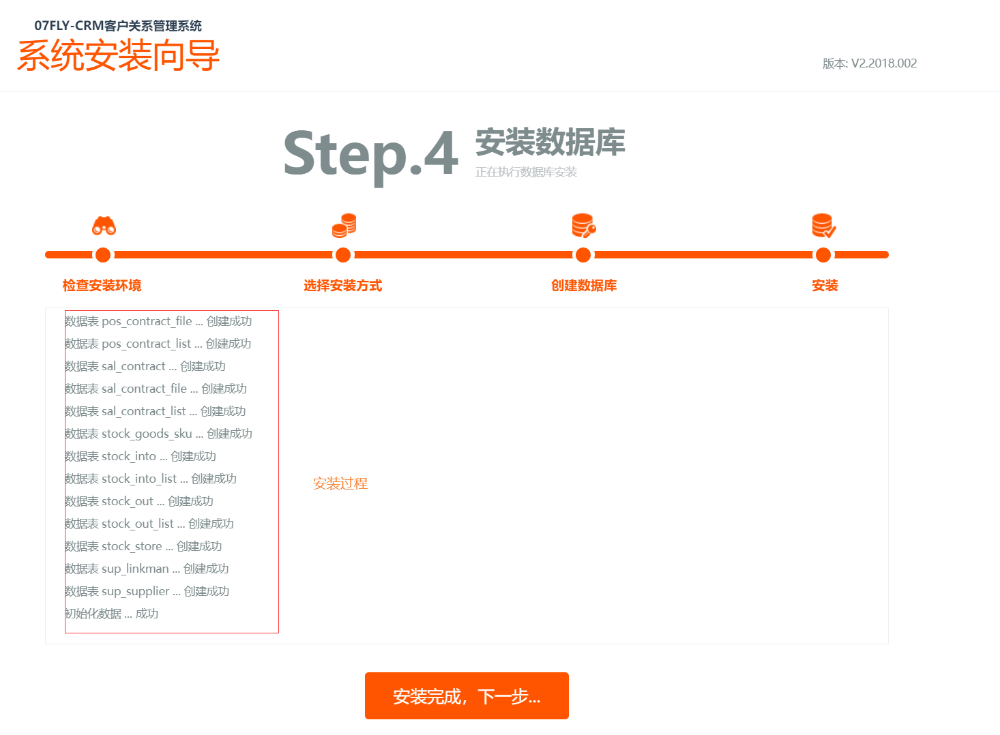

点击下一步

### 3.6 安装完成

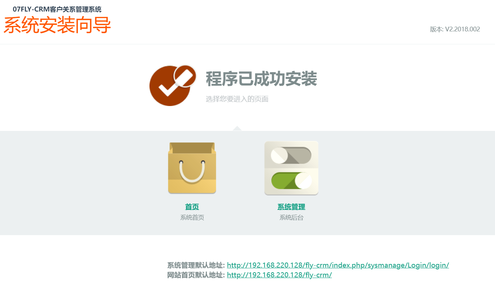

点击网站首页，就可以看到登录页面了，如下图所示

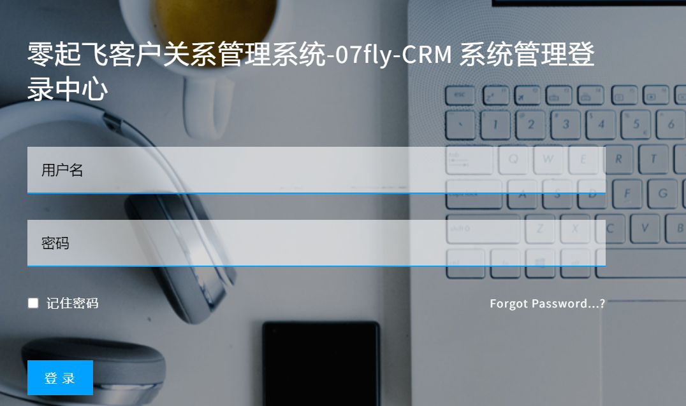

输入刚才设置设置管理员密码，比如我设置的是 `账号：admin 密码：123456`，登录成功后显示页面如下图所示

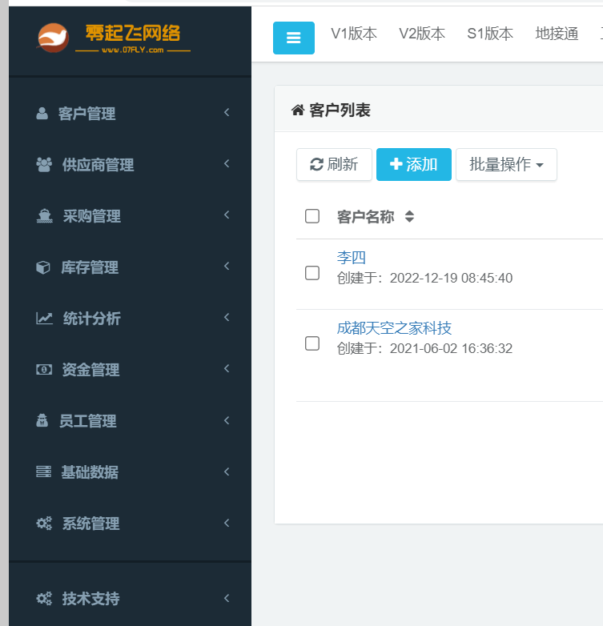

到此参考业务系统就构建好了,大家可以在本地测试倒腾了，玩坏了也没有关系，重新初始化一下项目就可以了回到最初的状态了。

